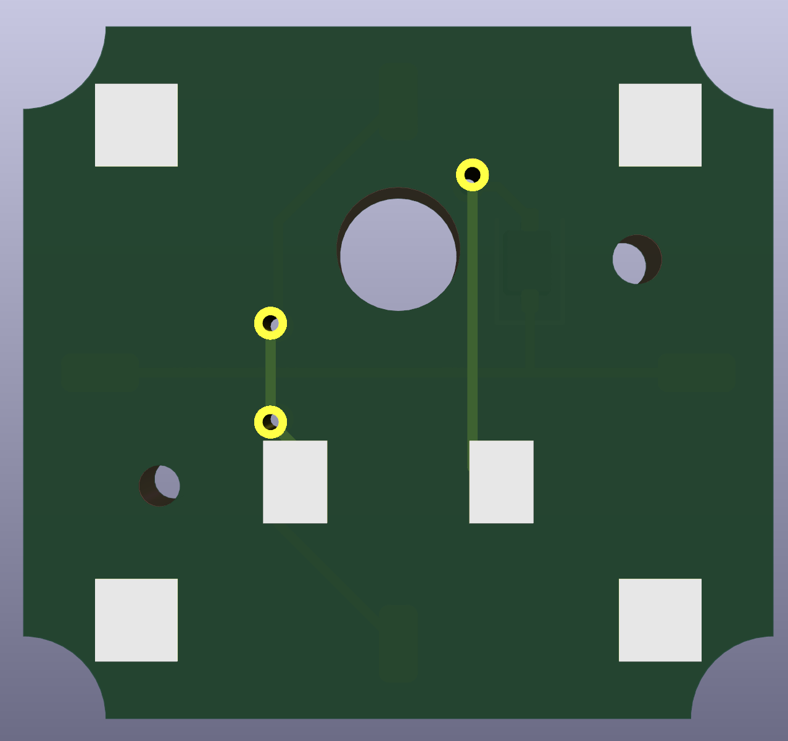
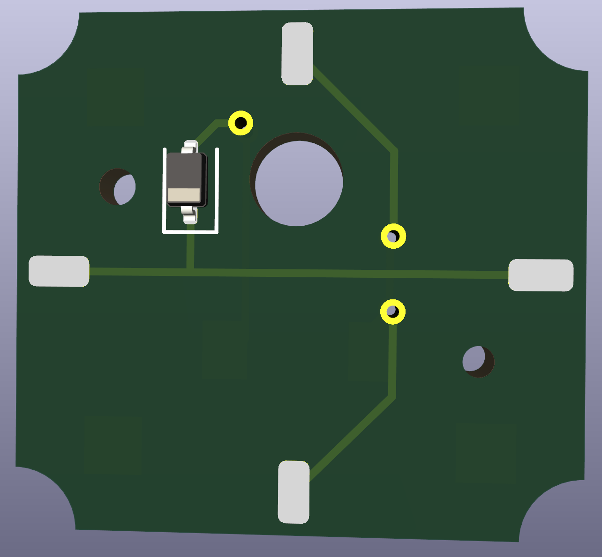

# Kailh PG1316S Ultra Low Profile Single PCBs

Very similar to [the Cherry ULP ones](https://github.com/jonboh/amoeba-cherry-ulp), the pcb itself is interchangeable and you can build my ULP Dactyl with either one of them.
But the switches can only be mounted in their corresponding PCB.

## Front

## Back

